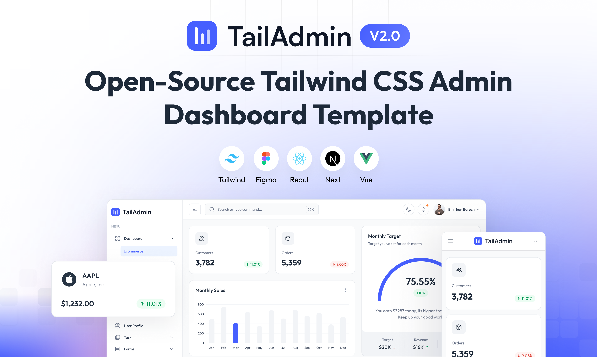

# IPTV Management System

A comprehensive IPTV business management system built with modern web technologies. This application provides a complete solution for managing IPTV platforms, products, clients, sales, and administrative operations.



## 🚀 Live Demo

- **Frontend:** [https://4ec14798.iptv-management-frontend.pages.dev](https://4ec14798.iptv-management-frontend.pages.dev)
- **Backend API:** [https://iptv-management-api.houidi-salaheddine.workers.dev/api](https://iptv-management-api.houidi-salaheddine.workers.dev/api)
- **Login Credentials:** Username: `ADMIN` | Password: `admin123`

## 🏗️ Architecture

This system is built with a modern, scalable architecture:

### Frontend
- **React 19** with TypeScript
- **Tailwind CSS** for styling
- **Vite** for build tooling
- **React Router** for navigation
- **Context API** for state management

### Backend
- **Cloudflare Workers** for serverless API
- **Cloudflare D1** SQLite database
- **RESTful API** design
- **CORS** enabled for cross-origin requests

### Deployment
- **Frontend:** Cloudflare Pages
- **Backend:** Cloudflare Workers
- **Database:** Cloudflare D1 (SQLite)

## ✨ Features

### 📊 Dashboard & Analytics
- Real-time business statistics and KPIs
- Interactive charts and data visualization
- Revenue tracking and performance metrics
- Recent activity monitoring

### 🏢 Platform Management
- Multi-platform support (point-based and currency-based)
- Platform configuration and settings
- Balance and recharge management
- Automatic pricing calculations

### 📦 Product Management
- Comprehensive product catalog
- Category-based organization
- Stock tracking and low-stock alerts
- Flexible pricing models (points/currency)
- Duration-based products (1 month, 3 months, 6 months, 1 year)

### 👥 Client Management
- Complete client database
- Client history and transaction tracking
- Simplified registration process
- Client activity monitoring

### 💰 Sales Management
- Streamlined sales process
- Automatic stock deduction
- Payment method tracking
- Sales history and reporting
- Invoice generation

### 🔐 Authentication & Security
- Secure admin authentication
- Role-based access control
- Session management
- Protected routes

### 🎨 User Interface
- Modern, responsive design
- Dark/Light theme support
- Mobile-friendly interface
- Intuitive navigation
- Consistent layout patterns

## 🛠️ Installation

### Prerequisites

- **Node.js** 18.x or later (recommended: Node.js 20.x+)
- **npm** or **yarn** package manager
- **Git** for version control

### Local Development Setup

1. **Clone the repository:**
   ```bash
   git clone https://github.com/salahouidi/iptv-mgmt.git
   cd iptv-mgmt
   ```

2. **Install frontend dependencies:**
   ```bash
   npm install
   ```

3. **Install backend dependencies:**
   ```bash
   cd workers
   npm install
   cd ..
   ```

4. **Environment Configuration:**
   ```bash
   # Copy environment template
   cp .env.example .env.development

   # Edit the environment variables as needed
   ```

5. **Start the development servers:**

   **Frontend:**
   ```bash
   npm run dev
   ```

   **Backend (in another terminal):**
   ```bash
   cd workers
   npm run dev
   ```

6. **Access the application:**
   - Frontend: `http://localhost:5173`
   - Backend API: `http://localhost:8787`

## 🚀 Deployment

### Production Deployment

This application is designed for deployment on Cloudflare's edge infrastructure:

#### Frontend (Cloudflare Pages)
```bash
# Build the frontend
npm run build

# Deploy to Cloudflare Pages
wrangler pages deploy dist --project-name iptv-management-frontend
```

#### Backend (Cloudflare Workers)
```bash
# Navigate to workers directory
cd workers

# Deploy the API
wrangler deploy
```

#### Database Setup (Cloudflare D1)
```bash
# Create D1 database
wrangler d1 create iptv-management-db

# Run migrations
wrangler d1 migrations apply iptv-management-db --local
wrangler d1 migrations apply iptv-management-db --remote
```

### Environment Variables

Create the following environment files:

**.env.development:**
```env
VITE_API_BASE_URL=http://localhost:8787/api
VITE_APP_ENV=development
```

**.env.production:**
```env
VITE_API_BASE_URL=https://your-worker.your-subdomain.workers.dev/api
VITE_APP_ENV=production
```

## 📁 Project Structure

```
iptv-mgmt/
├── src/                          # Frontend source code
│   ├── components/               # Reusable UI components
│   │   ├── auth/                # Authentication components
│   │   ├── common/              # Common UI components
│   │   ├── iptv/                # IPTV-specific components
│   │   └── ui/                  # Base UI components
│   ├── contexts/                # React Context providers
│   ├── hooks/                   # Custom React hooks
│   ├── pages/                   # Page components
│   │   ├── AuthPages/           # Authentication pages
│   │   └── IPTV/                # IPTV management pages
│   ├── types/                   # TypeScript type definitions
│   └── utils/                   # Utility functions
├── workers/                     # Backend source code
│   ├── src/
│   │   ├── routes/              # API route handlers
│   │   └── utils/               # Backend utilities
│   └── wrangler.toml           # Cloudflare Workers config
├── database/                    # Database schema and migrations
│   ├── migrations/              # SQL migration files
│   ├── schema.sql              # Database schema
│   └── seed.sql                # Sample data
└── public/                     # Static assets
```

## 🔧 API Endpoints

The backend provides a comprehensive RESTful API:

### Authentication
- `POST /api/auth/login` - Admin login
- `POST /api/auth/logout` - Admin logout

### Dashboard
- `GET /api/dashboard/stats` - Get dashboard statistics

### Platforms
- `GET /api/plateformes` - List all platforms
- `POST /api/plateformes` - Create new platform
- `PUT /api/plateformes/:id` - Update platform
- `DELETE /api/plateformes/:id` - Delete platform

### Products
- `GET /api/produits` - List products (with filters)
- `POST /api/produits` - Create new product
- `PUT /api/produits/:id` - Update product
- `DELETE /api/produits/:id` - Delete product

### Clients
- `GET /api/clients` - List clients (with filters)
- `POST /api/clients` - Create new client
- `PUT /api/clients/:id` - Update client
- `DELETE /api/clients/:id` - Delete client

### Sales
- `GET /api/ventes` - List sales (with filters)
- `POST /api/ventes` - Create new sale
- `PUT /api/ventes/:id` - Update sale
- `DELETE /api/ventes/:id` - Delete sale

### Recharges
- `GET /api/recharges` - List recharges
- `POST /api/recharges` - Create new recharge

## 🗄️ Database Schema

The application uses SQLite with the following main tables:

- **plateformes** - IPTV platform configurations
- **produits** - Product catalog with pricing
- **clients** - Customer database
- **ventes** - Sales transactions
- **recharges** - Platform balance recharges
- **administrateurs** - Admin user accounts

## 🧪 Testing

### Running Tests
```bash
# Run frontend tests
npm test

# Run backend tests
cd workers
npm test
```

### Manual Testing
1. Access the live demo at the provided URL
2. Login with the demo credentials
3. Test all CRUD operations
4. Verify responsive design on different devices

## 📝 Usage

### Creating a Sale
1. Navigate to "Ventes" → "Nouvelle Vente"
2. Select a platform
3. Choose a product
4. Select or create a client
5. Choose payment method
6. Complete the sale

### Managing Products
1. Go to "Articles" page
2. Add new products with pricing
3. Set stock quantities
4. Configure categories and durations

### Platform Configuration
1. Access "Plateformes" page
2. Configure point-based or currency-based systems
3. Set up automatic pricing rules
4. Manage platform balances

## 🤝 Contributing

Contributions are welcome! Please feel free to submit a Pull Request. For major changes, please open an issue first to discuss what you would like to change.

### Development Guidelines
1. Follow the existing code style and patterns
2. Write meaningful commit messages
3. Test your changes thoroughly
4. Update documentation as needed

## 📄 License

This project is licensed under the MIT License - see the [LICENSE.md](LICENSE.md) file for details.

## 🆘 Support

If you encounter any issues or have questions:

1. Check the [Issues](https://github.com/salahouidi/iptv-mgmt/issues) page
2. Create a new issue with detailed information
3. Provide steps to reproduce any bugs

## 🙏 Acknowledgments

- Built with [React](https://reactjs.org/) and [TypeScript](https://www.typescriptlang.org/)
- Styled with [Tailwind CSS](https://tailwindcss.com/)
- Deployed on [Cloudflare](https://cloudflare.com/) infrastructure
- Based on TailAdmin template for initial UI components

## 📊 Project Status

- ✅ **Frontend:** Fully functional with responsive design
- ✅ **Backend:** Complete API with all CRUD operations
- ✅ **Database:** Comprehensive schema with sample data
- ✅ **Deployment:** Live production environment
- ✅ **Authentication:** Secure admin access
- ✅ **Documentation:** Complete setup and usage guides

---

**Live Demo:** [https://4ec14798.iptv-management-frontend.pages.dev](https://4ec14798.iptv-management-frontend.pages.dev)

**Repository:** [https://github.com/salahouidi/iptv-mgmt](https://github.com/salahouidi/iptv-mgmt)
